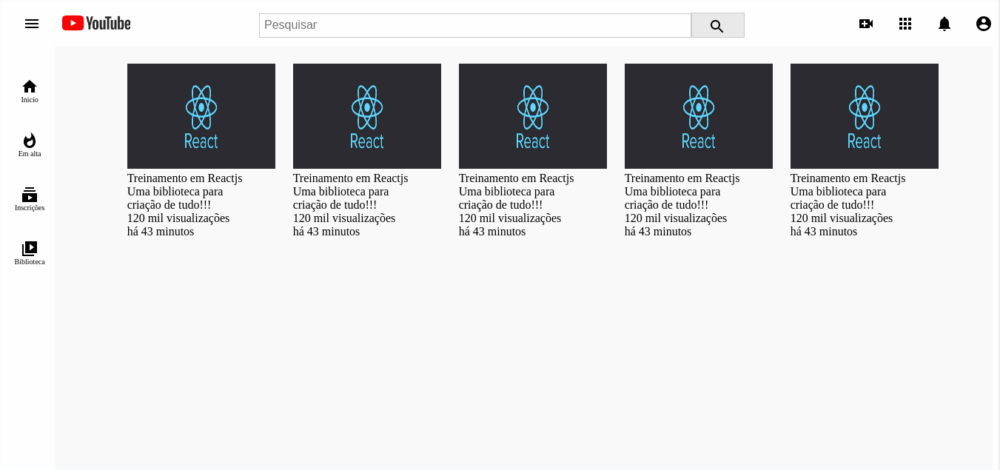

### Projeto clone (YouTube) usando a tecnologia <b>REACJS</b>
- Apenas um clone da parte virsual da aplicação de videos do youtube.

- Dentro do <b>README</b> da pasta do projeto está tudo que foi ou está sendo usando.
https://github.com/thiagoadssilva/youtubeClone/blob/main/clone/README.md

Obs - Treinamento na tecnologia.

## <b>Header</b> 

## <b>Base Lateral</b> 

## Inicio da parte do <b>centro</b> 

## Definido o layout do centro <b>centro</b> 

